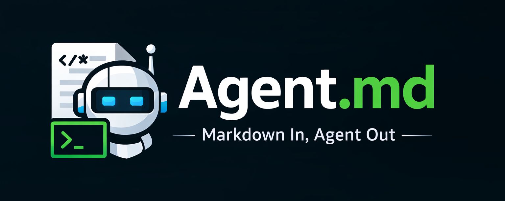

<div align="center">



<br>
<br>

[](https://python.org)
[](LICENSE)
[](https://github.com/langchain-ai/langgraph)

**Markdown-first runtime for AI agents**

Write a `.md` file, describe what your agent should do, and let it run.
No boilerplate. No frameworks to learn. Just Markdown.

[📖 Documentation](https://z-fab.github.io/agentmd) • [🚀 Quick Start](#quick-start) • [📦 Examples](#examples) • [🤝 Contributing](#contributing)

</div>

---

## ✨ Why Agent.md?

- **📄 One file = One agent** — YAML frontmatter for config, Markdown body for the prompt
- **⚡ Zero boilerplate** — No classes, decorators, or complex frameworks
- **🕐 Flexible triggers** — Run manually, on schedules (cron/intervals), or when files change
- **🔧 Built-in tools** — File I/O and HTTP requests work out of the box
- **🔌 MCP support** — Connect to any Model Context Protocol server
- **📊 Execution tracking** — Every run logged with status, duration, and token usage
- **🎯 Git-friendly** — Version control your prompts. See exactly how they evolved.

---

## 🚀 Quick Start

### Option A: One-line install (Linux/macOS)

```bash
curl -fsSL https://raw.githubusercontent.com/z-fab/agentmd/master/install.sh | bash
```

This installs `uv`, `agentmd`, and runs the interactive setup wizard.

**Windows (PowerShell):**
```powershell
irm https://raw.githubusercontent.com/z-fab/agentmd/master/install.ps1 | iex
```

### Option B: Developer setup

```bash
git clone https://github.com/z-fab/agentmd.git
cd agentmd
uv sync
uv pip install -e ".[all]"
agentmd setup
```

### Create Your First Agent

```bash
agentmd new hello-world
```

This uses AI to generate the agent from a description you provide. Or use `--template` for an interactive questionnaire:

```bash
agentmd new hello-world --template
```

You can also create agents manually — just add an `.md` file to `agents/`:

```markdown
---
name: hello-world
---

You are a friendly assistant. When asked to execute your task,
write a creative greeting and save it to 'greeting.txt'.
```

> **Note:** No `model` needed — Agent.md uses the default provider/model you configured during setup.

### Run It

```bash
agentmd run hello-world
```

**Output:**

```
  ▶ Running hello-world
    google / gemini-2.5-flash

  11:32:04  🤖 I'll create a friendly greeting...
  11:32:05  🔧 file_write → greeting.txt
  11:32:05  ✅ Done!

  ✓ hello-world completed in 1.8s
    Tokens: 42 in / 118 out / 160 total
    Execution #1
```

### Or Chat with It

Start a multi-turn conversation instead of a one-shot run:

```bash
agentmd chat hello-world
```

```
  Chat with hello-world
    google / gemini-2.5-flash
    Type /exit or Ctrl+C to end session

  > Write me a greeting in Portuguese
  11:33:01  🤖 Olá! Que seu dia seja cheio de...
  11:33:02  ✅ Done!

  > Now save it to greeting-pt.txt
  11:33:10  🔧 file_write → greeting-pt.txt
  11:33:10  ✅ Saved!

  Session ended: 2 turns, 280 tokens (84 in / 196 out), 12.3s
  Execution #2
```

That's it! 🎉

---

## ⚙️ Configuration

Agent.md uses two configuration files:

| File | Purpose |
|------|---------|
| `~/.config/agentmd/config.yaml` | Application settings (paths, default model) — auto-created on first run |
| `~/agentmd/.env` | Secrets only (API keys) |

```yaml
# ~/.config/agentmd/config.yaml
workspace: ~/agentmd
agents_dir: agents

defaults:
  provider: google
  model: gemini-2.5-flash
```

```bash
# ~/agentmd/.env
GOOGLE_API_KEY=your-key-here
```

Run `agentmd config` to see the current effective configuration.

---

## 📚 Examples

### Scheduled Tasks

Run agents on intervals or cron schedules:

```yaml
trigger:
  type: schedule
  every: 1h          # or use cron: "0 9 * * *"
```

### File Watching

Process files automatically as they appear:

```yaml
trigger:
  type: watch
  paths: data/uploads/
```

### Multi-Provider Support

Switch LLM providers with a config change:

```yaml
model:
  provider: openai       # google, anthropic, ollama, local
  name: gpt-4o
```

### MCP Integration

Use external tools via Model Context Protocol:

```yaml
mcp:
  - fetch      # Web fetching
  - github     # GitHub API
```

**[→ See all examples in documentation](https://z-fab.github.io/agentmd/examples)**

---

## 📖 Documentation

Comprehensive documentation is available at **[z-fab.github.io/agentmd](https://z-fab.github.io/agentmd)**

**Quick Links:**

- [Quick Start](https://z-fab.github.io/agentmd/quick-start)
- [Agent Configuration](https://z-fab.github.io/agentmd/agent-configuration)
- [CLI Reference](https://z-fab.github.io/agentmd/cli-reference)
- [Providers](https://z-fab.github.io/agentmd/providers)
- [Triggers](https://z-fab.github.io/agentmd/triggers)
- [Tools Documentation](https://z-fab.github.io/agentmd/tools/)
- [Examples](https://z-fab.github.io/agentmd/examples)
- [Security Best Practices](https://z-fab.github.io/agentmd/guides/security-best-practices)

---

## 🛠️ Tech Stack

| Component | Technology |
|---|---|
| Runtime | Python 3.13+ |
| Agent Framework | [LangGraph](https://github.com/langchain-ai/langgraph) |
| LLM Providers | Google, OpenAI, Anthropic, Ollama, Local |
| CLI | [Typer](https://typer.tiangolo.com/) + [Rich](https://rich.readthedocs.io/) |
| Database | SQLite (async via [aiosqlite](https://github.com/omnilib/aiosqlite)) |
| Scheduling | [APScheduler](https://apscheduler.readthedocs.io/) |

---

## 🤝 Contributing

Contributions are welcome! Please open an issue or pull request on [GitHub](https://github.com/z-fab/agentmd).

```bash
# Development setup
git clone https://github.com/z-fab/agentmd.git
cd agentmd
uv sync
uv pip install -e ".[all]"
agentmd setup              # Interactive setup wizard
ruff format .              # Format code
```

---

## 📜 License

MIT License — use it, fork it, build on it.

---

<div align="center">

**Built with ❤️ and Markdown**

*If agents could write themselves, they'd choose Markdown too.*

[⭐ Star on GitHub](https://github.com/z-fab/agentmd) • [📖 Read the Docs](https://z-fab.github.io/agentmd)

</div>
